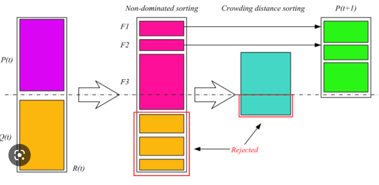

# Non Dominated Sorting Genetic Algorithm


NSGA-II is an evolutionary algorithm developed as an answer to the shortcomings of early evolutionary algorithms, which lacked elitism and used a sharing parameter in order to sustain a diverse Pareto set. NSGA-II uses a fast non-dominated sorting algorithm, sharing, elitism, and crowded comparison. Elitism implies that the best solutions of the previous iteration are kept unchanged in the current one. This significantly increases the convergence speed of the algorithm. Additionally, its use of a fast non-dominated sorting algorithm contributes to a significant reduction of its computational complexity. For more details, the interested reader is referred to Deb et al. (2002).

## MATLAB and Python versions of this algorithm are placed in this repository
In the following, the use of each the files and functions is said:

```CalcCrowdingDistance.py```: This module calculates crowding distance and list of frontiers

```Crossover.py```: This module gets parents and creates children (crossover operator)

```Dominates.py```: This module calculate domination for two member of population

```MOP2.py```: This module calculates each objective functions

```Mutate.py```: This module mutates a member of the population based on mutation rate.

```NonDominatedSorting.py```: This module sorts population based on non dominated sorting algorithm

```nsga2.py```: This is the main module of the algorithm

```PlotCosts.py```: This module plots the results

```SortPopulation.py```: This module sorts populations based on crowding distance and rank

## Installation
Below are the steps to install and use the Python version.

#### Step 1: clone the repository via link below
```angular2html
https://github.com/hamedasgari20/NSGA2.git
```

#### Step 2: create ```virtualenv``` and install dependencies via command below:
```angular2html
pip install -r requirements.txt
```
#### Step 3: run ```python nsga2.py``` to see the results

## Algorithm parameters
In the following parameters of the presented algorithm are presented.

```max_it```: Maximum Amount Iterations

```npop```: Population Size

```p_crossover```: Crossover Percentage

```n_crossover```: Amount Parents

```p_mutation```: Mutation Percentage

```mu```: Mutation Rate

```sigma```: Mutation Step Size

## Problem Definition
Here, a two-objective optimization problem is proposed, the parameters of which are written in lines 11 to 15. This algorithm can be used for many multi-objective optimization problems and can be used for different problems only by changing the these lines.

## Final point

This repository is free to use and will remain forever. I hope it can be used in scientific research and optimization problems.


Any suggestion to improve this repository is welcome

Best regards

__Hamed Asgari__